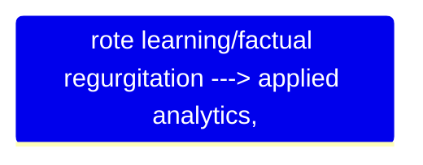

# A Retrospective of the Civil Services Exam

- The landscape of the civil services exam has undergone through a profound pedagogical and structural change.
- The following are tested in the Civil Services Exam.
  1. Candidates intellectual capacity.
  2. Analytical depth.
  3. Psychological endurance.
- An assessment of the past two decades paper show a definitive shift in assessment parameters.

